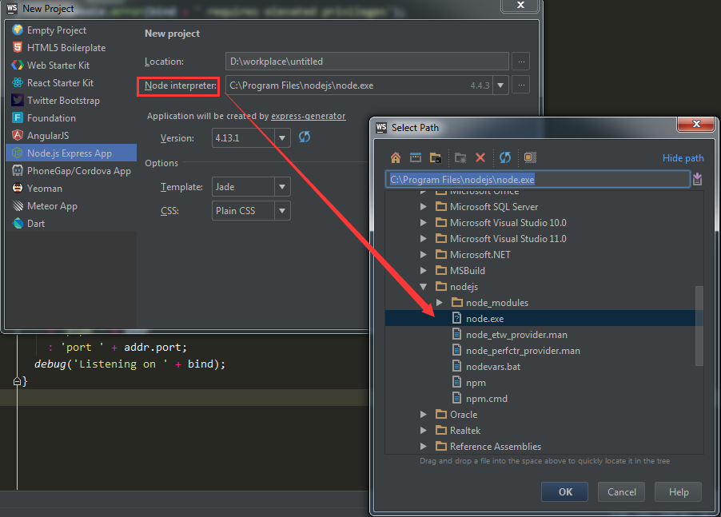
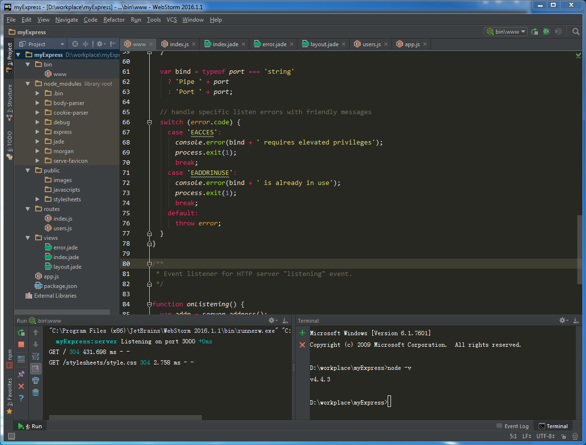
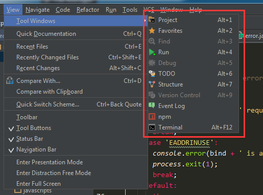
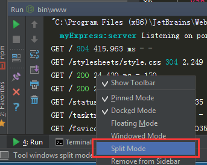

### 通过Webstorm创建一个Express项目
---
运行Webstorm，然后新建项目
`File->New->Project->Node.js Express App`

注意：
* Node interpreter(Node解析器)，选择node.exe
* express-generator会自动读取

然后Create，就可以看到自动生成的结构和常用的模块已加入

### 工具窗口的配置
---
上图下方出现两个窗口
* 运行项目后控制台窗口 `快捷键（Alt + 4）`
* 命令行窗口 `快捷键（Alt + F12）`

其他窗口的快捷键可查看`View->Tool Windows`

窗口分列显示设置如下图

