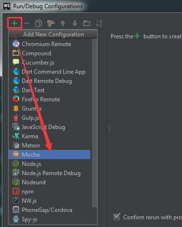
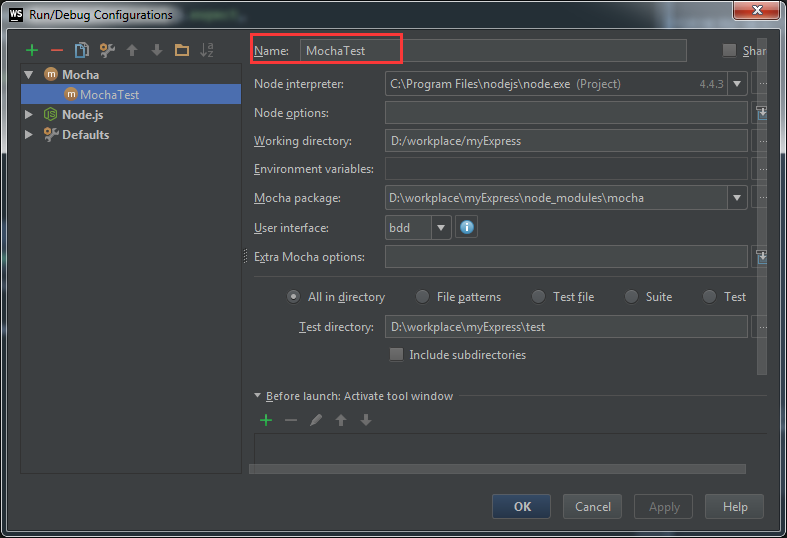
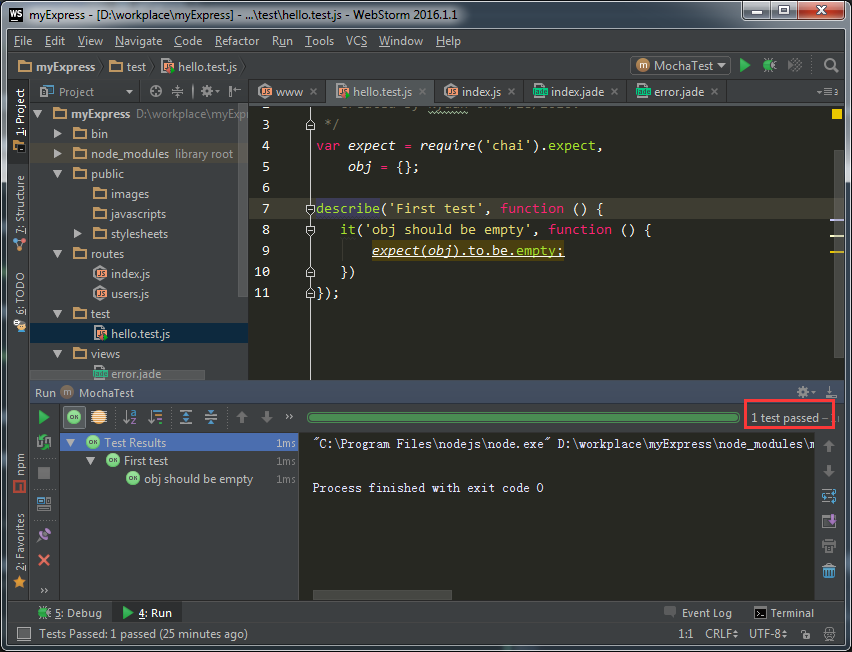

### 通过Webstorm创建一个Express项目
---
运行Webstorm，然后新建项目
`File->New->Project->Node.js Express App`


注意：
* Node interpreter(Node解析器)，选择node.exe
* express-generator会自动读取

然后Create，就可以看到自动生成的结构和常用的模块已加入


### 工具窗口的配置
---
上图下方出现两个窗口
* 运行项目后控制台窗口 `快捷键（Alt + 4）`
* 命令行窗口 `快捷键（Alt + F12）`

其他窗口的快捷键可查看`View->Tool Windows`


窗口分列显示设置如下图


### Webstorm集成mocha单元测试
---
先安装mocha，我选用的是断言库chai，一并安装。
```
npm install -g --save mocha
npm install --save chai
```
然后进入菜单栏，创建一个新的配置项
`Run->Edit Configurations`

选择绿色+添加Mocha



除了Name，其他基本都配置好无需修改



保存后操作`Run->Run MochaTest`或者`shift + F10`便可在Webstorm中使用Mocha

